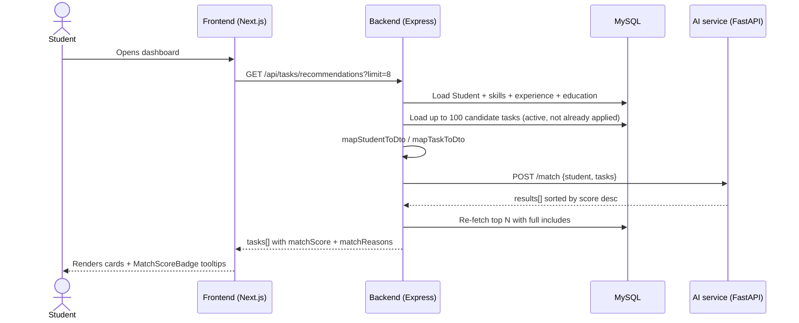

# Module 6 — AI Matching

This module ranks tasks for a student (recommendations) and ranks students for a task (applicant triage). It runs in a small FastAPI sidecar so the Node/Express backend stays free of Python dependencies.

## Components

- **Frontend (Next.js):** renders `MatchScoreBadge` on every task card and applicant row, plus a "Recommended" sort on the tasks browse page and a "Recompute match scores" button on the company task detail page.
- **Backend (Node + Sequelize):** owns persistence. Loads the student/task graph, maps it to the AI service's DTOs, calls the AI service over HTTP, and persists `Application.matchScore` so subsequent reads are O(1).
- **AI service (FastAPI):** stateless scoring engine. Exposes `POST /match` (student → tasks) and `POST /rank-candidates` (task → students). Optional sentence-transformer embeddings, otherwise TF-IDF.

## Data flow

The backend never lets the frontend talk to the AI service directly — DTOs are computed server-side from authoritative DB rows. The AI service has no DB access; it scores whatever is in the request body.

## Scoring formula

The final score (0–100) is a weighted sum of five components, computed in [`ai-service/app/services/matcher.py`](../../ai-service/app/services/matcher.py):

| Component         | Weight | What it measures                                                                 |
| ----------------- | ------ | -------------------------------------------------------------------------------- |
| `skill_match`     | 0.55   | Fraction of required skills the student has, weighted by level. Missing requireds are penalised harder than nice-to-haves. |
| `experience_fit`  | 0.15   | Mapping of `experience_years` to the task's `experience_level` band (entry 0–1y, intermediate 1–3y, expert 3y+). |
| `level_fit`       | 0.10   | Comparison of the student's dominant skill level to the level the task implies. |
| `interest_overlap`| 0.10   | Jaccard-ish overlap between `student.interests` and `task.tags`.                 |
| `text_similarity` | 0.10   | TF-IDF cosine between student bio + interests and task title + description. Swapped for sentence-transformer cosine when embeddings are enabled. |

The function is **pure and deterministic**: same input → same score, breakdown, and reasons. Reasons are human-readable bullets ("Strong match on 4/5 required skills", "Missing required skill: TypeScript", "Shared interests: react, frontend").

## Fallback behaviour

The HTTP client in [`backend/src/services/aiService.js`](../../backend/src/services/aiService.js) wraps every call with an 8-second timeout. On any failure it throws `AIServiceUnavailableError`, and callers degrade gracefully:

- **`getRecommendedTasks`** falls back to "latest `createdAt`" ordering with `matchScore: null`.
- **`getApplicationsForTask`** skips backfill but still returns the cached `matchScore` for rows that were scored previously.
- **`recomputeMatchesForTask`** returns HTTP 503 so the company can retry.
- **`applyToTask`** runs scoring fire-and-forget via `setImmediate`; never blocks the response.

Every call also pushes a `{ts, durationMs, ok, status}` sample into a 256-slot in-memory ring buffer. `GET /api/admin/ai-health` (admin-only) reads it and returns `{ reachable, p95LatencyMs, errorRatePerMin, lastSuccessAt }` — enough to triage incidents without a Prometheus dependency.

## Environment variables

| Variable                  | Default                  | Purpose                                                              |
| ------------------------- | ------------------------ | -------------------------------------------------------------------- |
| `AI_SERVICE_URL`          | `http://localhost:8000`  | Where the backend reaches the AI service. `http://ai-service:8000` inside Docker. |
| `AI_SERVICE_TIMEOUT_MS`   | `8000`                   | Axios timeout for every call.                                        |
| `AI_USE_EMBEDDINGS`       | `false`                  | When `true`, the AI service lazy-loads `sentence-transformers` and uses embedding cosine for `text_similarity`. Falls back to TF-IDF if the model fails to import. |
| `AI_EMBEDDING_MODEL`      | `all-MiniLM-L6-v2`       | Embedding model name passed to `SentenceTransformer(...)`.           |
| `BACKEND_URL` / `FRONTEND_URL` | —                  | Used by the AI service for CORS.                                     |
