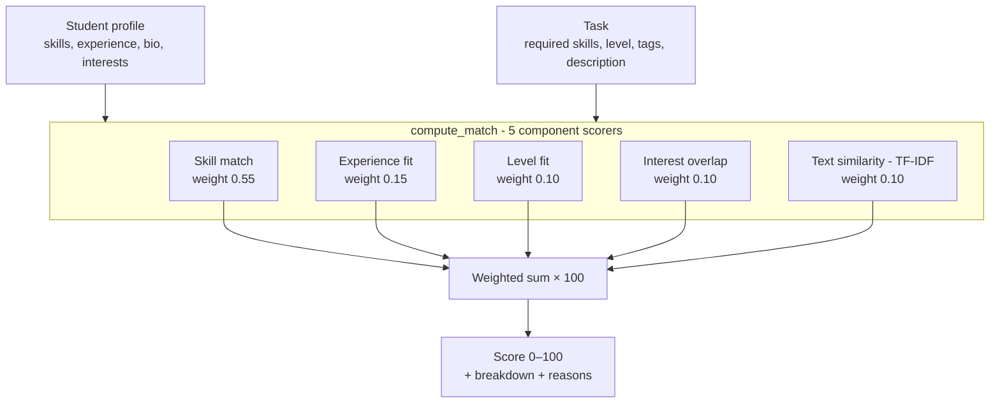

# Module 6 — AI Matching, Explained Simply

A plain-language companion to the technical
[architecture doc](architecture/module-6-ai-matching.md). Written to be readable
in a report or viva.

---

## 1. What it does (one line)

Given a **student** and a **task**, the engine produces a **match score from 0 to
100** — how well that student fits that task. The same score is used both ways:

- **Student side:** rank tasks for a student → recommendations.
- **Company side:** rank applicants for a task → "best match" candidate list.

It is **deterministic**: the same inputs always give the same score.

---

## 2. How the score is calculated

The final score is a **weighted sum of five ingredients**. Each ingredient is
scored between 0 and 1, multiplied by its weight, added together, then ×100.

| Ingredient | Weight | In plain English |
| ---------- | :----: | ---------------- |
| **Skill match** | **55%** | Does the student have the task's required skills, at a high enough level? Missing a *required* skill is penalised extra. This ingredient dominates. |
| **Experience fit** | 15% | Do the student's years of experience fit the task's band? (entry = 0–1y, intermediate = 1–3y, expert = 3y+) |
| **Level fit** | 10% | Is the student's strongest skill level (beginner / intermediate / advanced) at or above what the task needs? |
| **Interest overlap** | 10% | How many of the student's interests overlap with the task's tags? |
| **Text similarity** | 10% | How similar is the student's bio + skills text to the task's title + description text? |

> Because **skills are 55%**, a student in the right field scores high, and a
> student in the wrong field collapses to roughly 20–25% (the other ingredients
> can only lift a zero-skill match so far).

The engine also returns human-readable **reasons** (e.g. *"Strong match on 4/5
required skills"*, *"Missing required skill: Python"*) — these power the tooltip
shown on the match-score badges in the UI.

Implementation: [`ai-service/app/services/matcher.py`](../ai-service/app/services/matcher.py)

---

## 3. The scoring flow

---

## 4. Worked example

Using the seeded demo data (student **Alice**, a React developer):

| Task | Score | Why |
| ---- | :---: | --- |
| React Dashboard Development | **87%** | Has React / TypeScript / JavaScript at the right level → skill match ≈ 1.0; experience fits; tags overlap. |
| Customer Churn ML Model | **25%** | Missing every required Python / ML skill → skill match ≈ 0; only experience/level/text nudge it up. |

That gap is exactly why recommendations look meaningfully different per student.

---

## 5. What we used to build it

| Piece | Technology | Used for |
| ----- | ---------- | -------- |
| The service | **Python + FastAPI** | A small standalone "AI service" (port 8000) that the Node backend calls over HTTP. |
| Text similarity | **scikit-learn** (`TfidfVectorizer` + `cosine_similarity`) | The 10% text-similarity ingredient only. |
| Vector math | **NumPy** | Helper for the similarity computation. |
| Everything else | **Plain rule-based math** | Skill / experience / level / interest scoring — no library, no training. |

The Node backend never lets the browser talk to the AI service directly — it
builds the request from authoritative database rows, calls the service, and
stores the resulting `matchScore`.

---

## 6. Do we need a dataset?  →  **No.**

This is the key point:

- The engine is a **heuristic / rule-based scorer**, **not** a machine-learning
  model that must be *trained*. There is nothing to train, so **no training
  dataset is required**. It works as soon as a student and a company fill in
  their profiles.
- The text-similarity part (**TF-IDF**) also needs **no dataset**. TF-IDF builds
  its word vocabulary *on the spot* from just the two pieces of text being
  compared (this student's text vs this task's text). It is not pre-trained on a
  corpus.
- The only "data" it needs is your **own application data** — the skills,
  experience, tags, and descriptions users enter. (That is why we seed demo
  students / companies / tasks: so there is something to match.)

### Optional upgrade (currently OFF)

There is a feature flag, `AI_USE_EMBEDDINGS=true`, that swaps TF-IDF for
**sentence-transformers** (`all-MiniLM-L6-v2`) to get smarter *semantic* text
matching (e.g. understanding that "frontend" is close to "React"). Even then you
**do not build a dataset** — it downloads a *pre-trained* model made by others.
It is off by default because it is heavier, and TF-IDF is enough for the demo.

---

## 7. One-line summary (for the report)

> Module 6 is a **content-based recommendation engine** (a standard AI technique)
> that combines a deterministic weighted feature-scoring model (skills 55%,
> experience 15%, level 10%, interests 10%, text 10%) with a scikit-learn
> **TF-IDF / cosine-similarity NLP** component, served via a Python/FastAPI
> microservice and extensible to transformer embeddings. It needs no training
> dataset — it scores directly from user-entered profile and task data (the
> correct approach for a new platform with no interaction history).

---

## 8. "Is this really AI?" — how to defend it

The module is named **AI-based Matching**, and calling it AI is legitimate. The
phrase "rule-based math" used above is a *plain-English simplification of the
mechanics* — the correct academic description is a **content-based
recommendation system with an NLP similarity component**, which is genuinely AI.
You do not need to overstate anything; you need the right vocabulary.

### 8.1 Why it qualifies as AI (three pillars)

"AI" is far broader than "a neural network trained on a dataset." This system
sits in three recognised AI categories at once:

1. **Content-based recommender system** — a textbook AI/ML technique. It ranks
   items (tasks) by matching *item features* (required skills, tags, level)
   against a *user profile* (student skills, interests, experience). Recommender
   systems are a standard topic in AI/ML courses; content-based filtering is
   exactly what this engine does.
2. **NLP / classical machine learning** — the text-similarity component uses
   **TF-IDF vectorization + cosine similarity**, implemented with **scikit-learn**
   (a machine-learning library). TF-IDF is a core Natural Language Processing /
   Information Retrieval method — a named ML/NLP technique, not "just math."
3. **Knowledge / rule-based (symbolic) AI** — the weighted feature-scoring rules
   fall under classical / symbolic AI (rule-based expert systems are one of the
   oldest branches of AI). A **deep-learning upgrade path** is already built in
   via sentence-transformer embeddings (see §5 optional upgrade).

### 8.2 The strongest defence: cold-start + no labelled data

The most likely challenge is *"why not a trained ML model / neural network?"*
The answer is an **engineering strength, not a weakness**:

> A supervised ML recommender needs historical interaction data — records of
> which students applied to, were hired for, or succeeded at which tasks. As a
> new platform we have none of that (the **cold-start problem**). Content-based
> filtering is the standard, correct approach when there is no labelled training
> data: it works from day one using item and profile features. Once the platform
> accumulates interaction history, the architecture can evolve toward
> collaborative filtering or a learned model.

The **cold-start problem** is a named concept in recommender-systems literature;
citing it shows you understand *why* this design was chosen.

### 8.3 Turn a weakness into a feature: Explainable AI (XAI)

The engine outputs human-readable **reasons** (e.g. *"Strong match on 4/5
required skills"*, *"Missing required skill: Python"*). This is **Explainable AI**
— a recognised research area. Black-box neural networks cannot justify their
outputs; this model can. Framing:

> We deliberately chose an interpretable / explainable model so users see **why**
> they matched, rather than an opaque score from a black box.

### 8.4 Viva / evaluation Q&A

| Likely question | Suggested answer |
| --------------- | ---------------- |
| "Is this really AI?" | "Yes — it's a content-based recommender system, a standard AI technique, with a TF-IDF/cosine NLP component built on scikit-learn." |
| "Where is the machine learning?" | "The text-similarity module uses TF-IDF vectorization and cosine similarity (classical ML/NLP), with an optional transformer-embeddings mode." |
| "Why no neural network / trained model?" | "Cold-start — there is no interaction data yet. Content-based filtering is the correct choice for a new platform; a supervised/learned model becomes possible once usage data accumulates." |
| "How is it intelligent?" | "It reasons over structured features and unstructured text to rank fit, and explains its decisions — i.e. explainable AI." |
| "Is TF-IDF AI?" | "Yes — it's a standard NLP / information-retrieval technique from the machine-learning toolkit (scikit-learn)." |

### 8.5 Making the AI claim undeniable (optional)

The engine defaults to TF-IDF for the text component. Setting the feature flag
**`AI_USE_EMBEDDINGS=true`** swaps in a **transformer neural network**
(`all-MiniLM-L6-v2`, via `sentence-transformers`) for semantic similarity. With
that enabled, "we use a deep-learning language model for semantic matching" is
literally true. It is already implemented — it only needs enabling and the
`sentence-transformers` dependency installed. Trade-offs: a slower first request
and a one-time ~90 MB model download.

### 8.6 Defensible framing (use this wording)

> Module 6 is a **hybrid content-based recommendation engine**: it combines a
> weighted, explainable feature-scoring model with an **NLP text-similarity
> component (TF-IDF + cosine similarity, scikit-learn)**, and can be switched to
> **transformer sentence embeddings** for semantic matching. Content-based
> filtering is the appropriate AI approach here because the platform has no
> historical interaction data to train a supervised model on (the cold-start
> problem), and the rule-based scoring makes every recommendation **explainable**.
